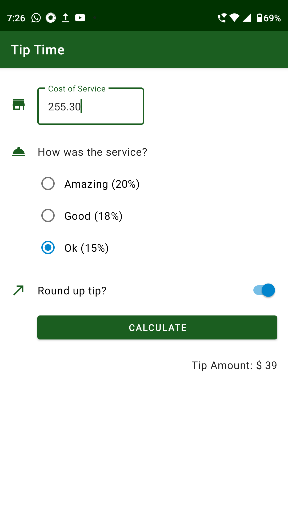

# Tip Time

An application for calculating the tip amount that can be given for the services.

## Features

- Light/dark mode toggle
- Live previews
- Fullscreen mode

## Screenshots

     

## 🔗 Links

